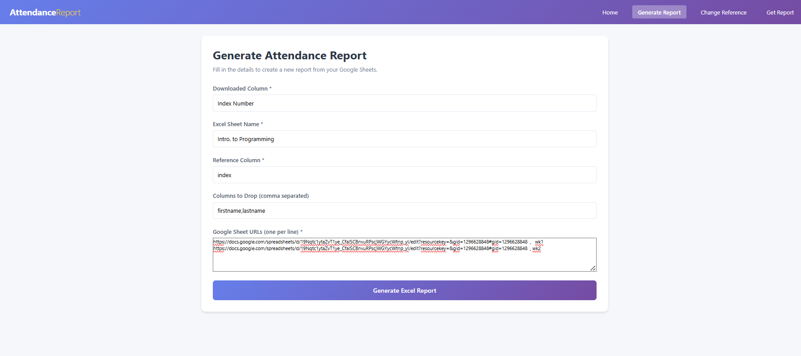

# AttendanceApp

**AttendanceApp** is a lightweight reporting tool for managing attendance data collected via **Google Forms** and **Google Sheets**.  
It helps automate attendance tracking by comparing submitted form data with a class reference list and generating structured Excel reports.

---

## 🚀 Features
- Separate **frontend** and **backend** architecture for flexibility.  
- Accepts multiple Google Sheet links for modular attendance tracking.  
- Allows users to specify columns to drop (optional).  
- Compares attendance data against a reference class list.  
- Generates downloadable Excel reports grouped by sheet name.

---

## 🧩 How It Works
1. **Collect attendance** using Google Forms.  
2. **Export responses** to Google Sheets.  
3. **Submit sheet links** to the application along with column names (comma‑separated).  
4. The app compares attendance data with the reference class list and generates a report.

Each sheet link is paired with a column name using a comma (`,`), and new sheets are separated by new lines.

---

## ⚙️ Setup Instructions

### 1. Clone the repository
```bash
git clone https://github.com/truthmyson/attendanceApp.git
cd attendanceApp
```

### 2. Run the frontend
```bash
cd frontend
npm run dev
```
Frontend runs on **port 5173**.

### 3. Run the backend
Open a new terminal:
```bash
cd src
python app.py
```
Backend runs on **port 3636**.

---

## 🖥️ Using the Application
1. Open the frontend in your browser (`http://localhost:5173`).  
2. Fill out the **Generate Attendance Report** form:
   - **Downloaded Column** → Column name from the attendance sheet (e.g., `Index Number`).  
   - **Excel Sheet Name** → Name for the generated report (e.g., `Intro. to Programming`).  
   - **Reference Column** → Column in the reference class list used for comparison (e.g., `index`).  
   - **Columns to Drop** → Optional columns to exclude (comma‑separated).  
   - **Google Sheet URLs** → Paste one sheet link per line, followed by a comma and the column name.

3. Click **Generate Excel Report** to create your report.

---

## 📘 Reference and Download Page
- Upload a **class list** (reference file) used to compare attendance data.  
- You can also **download** the generated report after processing.

---

## 🧠 Example


